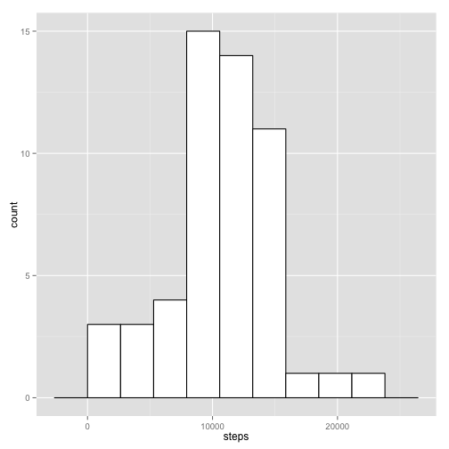
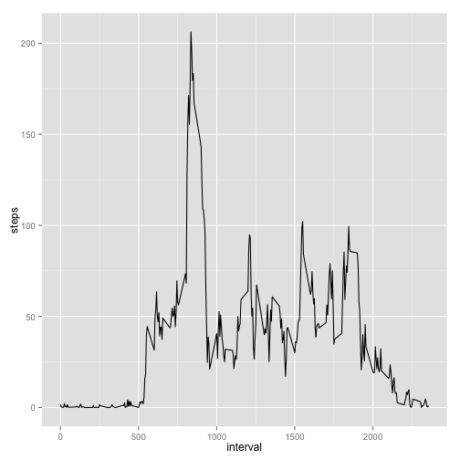
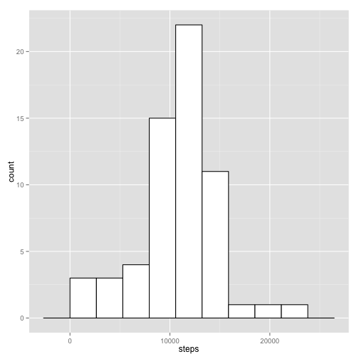
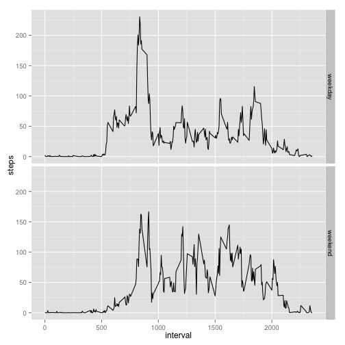

***
## Loading and preprocessing the data


```r
setwd("~/source/R/Reproducable Research/RepData_PeerAssessment1/")
download.file("https://d396qusza40orc.cloudfront.net/repdata%2Fdata%2Factivity.zip",
              "activity.zip", method = "curl")
unzip("activity.zip")
data <- read.csv("activity.csv")
library(ggplot2)
library(dplyr)
library(chron)
head(data)
```

```
##   steps       date interval
## 1    NA 2012-10-01        0
## 2    NA 2012-10-01        5
## 3    NA 2012-10-01       10
## 4    NA 2012-10-01       15
## 5    NA 2012-10-01       20
## 6    NA 2012-10-01       25
```
***
## What is mean total number of steps taken per day?

Calculate the total number of steps taken per day.

```r
totalSteps <- aggregate(steps ~ date, data, sum)
head(totalSteps)
```

```
##         date steps
## 1 2012-10-02   126
## 2 2012-10-03 11352
## 3 2012-10-04 12116
## 4 2012-10-05 13294
## 5 2012-10-06 15420
## 6 2012-10-07 11015
```
Histogram of the total number of steps taken each day:

```r
binwidth = (max(totalSteps$steps) - min(totalSteps$steps))/ceiling(sqrt(nrow(totalSteps)))
g <- ggplot(totalSteps, aes(steps))
g + geom_histogram(binwidth = binwidth, colour = "black", fill = "white")
```

 

```r
mean <- format(mean(totalSteps$steps), nsmall = 3)
median <- median(totalSteps$steps)
```
Mean of the total number of steps taken per day is **10766.189**. And median is **10765**.

***
## What is the average daily activity pattern?

Time series plot of the 5-minute interval and the average number of steps taken,
averaged across all days:

```r
meanSteps <- aggregate(steps ~ interval, data, "mean")
ggplot(meanSteps, aes(interval, steps)) + geom_line()
```

 

```r
maxInterval <- meanSteps[meanSteps$steps == max(meanSteps$steps), "interval"]
```
The **835** 5-minute interval, on average across all the days in the dataset,
contains the maximum number of steps.

***
## Imputing missing values


```r
totalNA <- length(data[is.na(data$steps), "steps"])
```
Total number of missing values in the dataset is **2304**.

Use the mean for 5-minute interval for filling in all of the missing values in the dataset:

```r
dataNoNA <- merge(data, meanSteps, by = "interval")
dataNoNA[is.na(dataNoNA$steps.x), "steps.x"] <- dataNoNA[is.na(dataNoNA$steps.x), "steps.y"]
dataNoNA <- dataNoNA[, 1:3]
names(dataNoNA)[2] <- "steps"
```

Histogram of the total number of steps taken each day after imputing missing values:

```r
totalStepsNoNA <- aggregate(steps ~ date, dataNoNA, sum)
binwidth = (max(totalStepsNoNA$steps) - min(totalStepsNoNA$steps))/ceiling(sqrt(nrow(totalStepsNoNA)))
g <- ggplot(totalStepsNoNA, aes(steps))
g + geom_histogram(binwidth = binwidth, colour = "black", fill = "white")
```

 

```r
meanNoNA <- format(mean(totalStepsNoNA$steps), nsmall = 3)
medianNoNA <- format(median(totalStepsNoNA$steps), nsmall = 3)
```
The mean total number of steps taken per day after imputing missing values is **10766.189**.
And the median is **10766.189**.

Filling in the missing values in the dataset doesn't really change mean and median of steps taken per day. But the histogram changed, because the number of measurements changed.

***
## Are there differences in activity patterns between weekdays and weekends?

Add a new factor variable in the dataset with two levels – “weekday” and “weekend”
indicating whether a given date is a weekday or weekend day.

```r
dataNoNA <- mutate(dataNoNA, day = is.weekend(as.POSIXlt(date)))
dataNoNA$day <- factor(dataNoNA$day)
levels(dataNoNA$day) <- c("weekday", "weekend")
```
Panel plot containing a time series plot of the 5-minute interval and the average
number of steps taken, averaged across all weekday days or weekend days.

```r
meanStepsWDay <- aggregate(steps ~ interval + day, dataNoNA, "mean")
ggplot(meanStepsWDay, aes(interval, steps)) + geom_line() + facet_grid(day ~ .)
```

 
